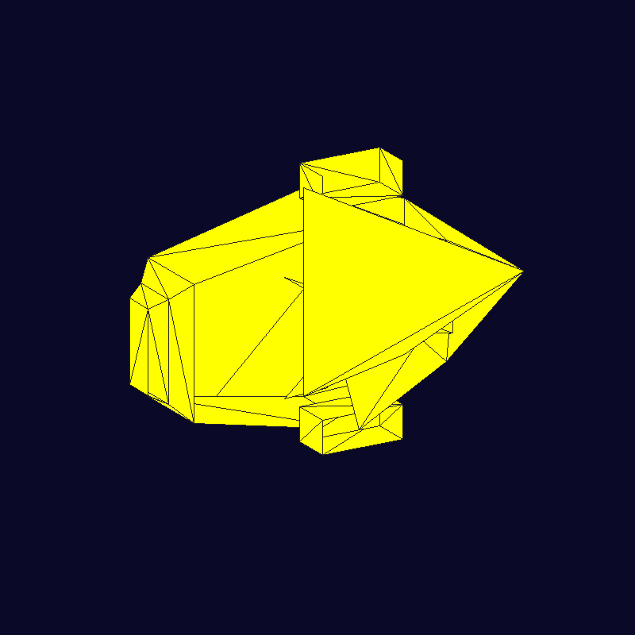

# Paint Spaceship - Software Renderer

Proyecto de renderizado 3D por software que carga un modelo OBJ (spaceship) y lo dibuja en pantalla usando rasterización manual de triángulos.

## Descripción

Este proyecto implementa un renderizador de software desde cero que:
- Carga modelos 3D en formato OBJ
- Recorre manualmente las caras del modelo usando índices de vértices
- Dibuja cada triángulo usando rasterización basada en coordenadas baricéntricas
- Centra y escala automáticamente el modelo para que aparezca completo en pantalla
- Usa SDL2 para la ventana y presentación de píxeles

## Resultado



El modelo se renderiza con:
- **Color de relleno**: Amarillo (RGB: 255, 255, 0)
- **Bordes (wireframe)**: Gris oscuro (RGB: 40, 40, 40)
- **Fondo**: Azul oscuro espacial (RGB: 10, 10, 40)
- **Vértices**: 51
- **Triángulos**: 84 (generados desde quads y triángulos originales)
- **Resolución**: 800x800 píxeles
- **Vista**: Proyección isométrica (rotación 30° en Y, 20° en X) para ver la nave en 3D
- **Centrado y escalado**: Automático al 70% de la ventana

## Características Técnicas

### Implementación

El proyecto está implementado en **Rust** con las siguientes características:

1. **Cargador de OBJ**: Función `cargar_obj()` que parsea archivos .obj
   - Soporta vértices (`v x y z`)
   - Soporta caras triangulares y polígonos (triangulados automáticamente)
   - Maneja índices positivos y negativos
   - El modelo spaceship tiene 51 vértices y genera 84 triángulos desde quads

2. **Transformación a pantalla**: Función `transformar_a_pantalla()`
   - Calcula el centroide del modelo
   - Calcula el AABB (Axis-Aligned Bounding Box)
   - **Proyección isométrica 3D** con rotaciones:
     - Rotación de 30° alrededor del eje Y (horizontal)
     - Rotación de 20° alrededor del eje X (vertical)
   - Escala el modelo al 70% de la dimensión menor de la ventana
   - Centra el modelo en pantalla
   - Permite ver la nave espacial desde un ángulo 3/4 que muestra su forma

3. **Rasterización**: Función `dibujar_triangulo()`
   - Usa coordenadas baricéntricas para determinar si un píxel está dentro del triángulo
   - Recorre solo el bounding box del triángulo (optimización)
   - Implementa edge function para cálculo eficiente

4. **Wireframe (bordes)**: Funciones `dibujar_linea()` y `dibujar_wireframe()`
   - Algoritmo de Bresenham para dibujar líneas eficientemente
   - Dibuja los bordes de cada triángulo en color gris oscuro
   - Permite ver la estructura geométrica de la nave espacial

5. **Framebuffer**: Estructura `Framebuffer`
   - Buffer de píxeles en formato ARGB8888
   - Función para limpiar pantalla
   - Función para guardar PNG usando la librería `image`

6. **Renderizado manual**: Función `render_modelo()`
   - **Recorre manualmente** todas las caras del modelo
   - Usa los índices `i0`, `i1`, `i2` de cada cara para obtener los vértices
   - Llama a `dibujar_triangulo()` para rellenar cada cara
   - Llama a `dibujar_wireframe()` para dibujar los bordes
   - Implementa backface culling opcional

## Estructura del Código

```rust
// Estructura de una cara (triángulo)
struct Cara {
    i0: usize,  // índice del primer vértice
    i1: usize,  // índice del segundo vértice
    i2: usize,  // índice del tercer vértice
}

// Renderizado manual de todas las caras
/// Dibuja todas las caras recorriendo los índices manualmente
fn render_modelo(
    fb: &mut Framebuffer,
    verts2d: &[Vec2i],
    caras: &[Cara],
    color: Color,
    color_wireframe: Color,
    culling: bool,
    mostrar_wireframe: bool,
) {
    fb.set_color(color);
    for cara in caras {
        let a = verts2d[cara.i0];  // Obtener vértice 1 usando índice i0
        let b = verts2d[cara.i1];  // Obtener vértice 2 usando índice i1
        let c = verts2d[cara.i2];  // Obtener vértice 3 usando índice i2
        
        if culling {
            let area = edge_fn(&a, &b, &c);
            if area <= 0 {
                continue;  // No dibujar caras traseras
            }
        }
        
        // Rellenar el triángulo con color amarillo
        dibujar_triangulo(fb, a, b, c, color);
        
        // Dibujar los bordes para ver la estructura 3D
        if mostrar_wireframe {
            dibujar_wireframe(fb, a, b, c, color_wireframe);
        }
    }
}
```

## Requisitos

- **Rust** (rustc 1.70+)
- **Cargo** (gestor de paquetes de Rust)
- SDL2 (incluido como dependencia con `bundled` feature)

## Compilación

```bash
cargo build --release
```

El binario optimizado se generará en: `target/release/paint_spaceship`

## Ejecución

### Opción 1: Con cargo

```bash
cargo run --release
```

### Opción 2: Ejecutable directo

```bash
# En Linux
LD_LIBRARY_PATH=./target/release:$LD_LIBRARY_PATH ./target/release/paint_spaceship

# O especificar otro modelo OBJ
LD_LIBRARY_PATH=./target/release:$LD_LIBRARY_PATH ./target/release/paint_spaceship assets/spaceship.obj
```

## Controles

- **ESC**: Salir del programa
- **S**: Guardar captura de pantalla como `captura.png`

## Archivos del Proyecto

```
paint_spaceship/
├── Cargo.toml              # Configuración del proyecto Rust
├── README.md               # Este archivo
├── spaceship_render.png    # Captura del modelo renderizado
├── assets/
│   └── spaceship.obj       # Modelo 3D del spaceship
└── src/
    └── main.rs             # Código fuente principal
```

## Dependencias

```toml
[dependencies]
sdl2 = { version = "0.36", features = ["bundled"] }  # Librería gráfica
image = "0.25"                                        # Guardar PNG
```

## Detalles de Implementación

### Algoritmo de Rasterización

El renderizador usa el método de **edge functions** para determinar si un píxel está dentro de un triángulo:

```rust
fn edge_fn(a: &Vec2i, b: &Vec2i, c: &Vec2i) -> i32 {
    (b.x - a.x) * (c.y - a.y) - (b.y - a.y) * (c.x - a.x)
}
```

Para cada píxel `p` dentro del bounding box del triángulo, se calculan tres pesos `w0`, `w1`, `w2`:
- Si todos tienen el mismo signo → el píxel está dentro del triángulo
- Se pinta el píxel con el color especificado

### Backface Culling

El código implementa backface culling opcional para no dibujar triángulos que miran hacia atrás:

```rust
let area = edge_fn(&a, &b, &c);
if area <= 0 {
    continue;  // Triángulo mirando hacia atrás
}
```

## Autor

Proyecto creado para el curso de Gráficas por Computadora.

## Licencia

Este proyecto es de uso académico.
